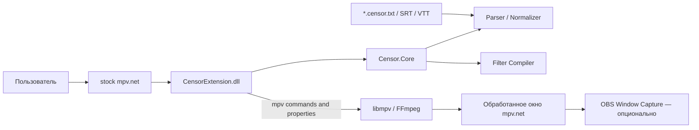

# Техническое задание v1.3.1

## Censor Extension для mpv.net: полноэкранное размытие фильма по таймкодам

**Статус:** нормативная версия для реализации
**Приоритет платформ:** Windows P0; macOS — отдельная последующая стадия
**Базовый плеер:** stock mpv.net без обязательного форка
**Основная форма поставки:** .NET extension + конфигурация mpv.net
**Дата версии:** 31 июля 2026 года

> В нормативной версии v1.3.1 учтены результаты проверки архитектуры. Из неё исключены SQLite, библиотека фильмов, долговременные привязки расписаний, fingerprint и миграции хранилища. Расписание действует только в текущей сессии воспроизведения или автоматически загружается из sidecar-файла с тем же базовым именем, что и фильм.

---

## 1. Цель продукта

Разработать расширение для mpv.net под Windows, которое:

1. позволяет открыть обычный текстовый файл с интервалами размытия;
2. применяет сильное размытие ко всему изображению плеера на указанных интервалах;
3. корректно работает при паузе, перемотке, изменении скорости и переходе по главам;
4. позволяет удобно создавать и редактировать таймкоды через графическое меню;
5. не требует базы данных, каталога фильмов или предварительной регистрации фильма;
6. не меняет привычный сценарий просмотра в mpv.net;
7. при необходимости автоматически подхватывает sidecar-файл рядом с фильмом.

OBS, если используется, только захватывает уже обработанное окно mpv.net и не участвует в синхронизации.

---

## 2. Границы продукта

### 2.1. Что входит в Windows P0

- stock mpv.net;
- .NET extension `CensorExtension.dll`;
- простой текстовый формат `*.censor.txt`;
- импорт SRT и WebVTT;
- выбор расписания через меню и file picker;
- drag-and-drop расписания в окно extension;
- необязательный автоподхват sidecar;
- редактор интервалов;
- компиляция интервалов в FFmpeg timeline filter;
- применение, проверка и восстановление фильтра;
- настройки blur и временных допусков;
- логи и диагностика;
- portable package и Windows installer.

### 2.2. Что не входит в P0

- SQLite или любая другая база фильмов;
- долговременная связь «фильм → расписание»;
- централизованный каталог расписаний;
- поиск расписания по fingerprint;
- перенос привязок после переименования фильма;
- массовая индексация каталогов;
- облачная синхронизация;
- сетевые запросы;
- автоматическое скачивание расписаний;
- обязательный форк mpv.net;
- полноценная версия для macOS.

---

## 3. Решение о надежности первого кадра

Необработанная заставка при открытии фильма — не блокер, если она не попадает в заданный интервал размытия.

Проект не обязан:

- блокировать первый декодированный кадр;
- держать обязательный черный guard;
- модифицировать ранний lifecycle mpv.net;
- создавать форк только ради first-frame protection.

Блокеры:

- отсутствие blur внутри активного интервала после применения расписания;
- преждевременное отключение blur;
- drift после seek, pause/resume или изменения скорости;
- применение расписания предыдущего фильма к новому фильму;
- потеря фильтра без обнаружения;
- неверное чтение границ таймкодов;
- повреждение файла при сохранении;
- падение mpv.net из-за необработанного исключения extension.

### 3.1. Ранние интервалы

Если первый интервал начинается менее чем через `early_interval_guard_ms` от текущей позиции, extension должен:

1. запомнить состояние `pause`;
2. временно поставить воспроизведение на паузу;
3. применить и проверить filtergraph;
4. восстановить исходное состояние `pause`.

Значение по умолчанию: `3000` мс.

---

## 4. Архитектура



### 4.1. `Censor.Core`

Кроссплатформенная .NET-библиотека без зависимости от UI mpv.net:

- модель расписания;
- parser `*.censor.txt`;
- импорт SRT/WebVTT;
- serializer;
- validation;
- нормализация интервалов;
- lead-in/lead-out и global offset;
- компилятор FFmpeg expressions;
- escaping;
- unit- и property-based тесты.

### 4.2. `Censor.MpvNet.Extension`

Расширение для Windows:

- отдельный mpv client;
- события загрузки и закрытия медиа;
- чтение `path`, `duration`, `time-pos`, `pause`, `speed`, `vf`;
- file picker;
- tool window с drag-and-drop;
- таблица интервалов;
- применение и удаление labeled filters;
- watchdog;
- настройки;
- логирование и diagnostics bundle.

### 4.3. Хранилище

Постоянно сохраняются только:

- глобальные настройки extension;
- последняя использованная папка с расписаниями;
- положение и размер окна extension;
- логи;
- недавно использованные значения UI, не связанные с конкретным фильмом.

Не сохраняются:

- связи между фильмами и расписаниями;
- пути последних фильмов;
- per-film offsets;
- per-film strict mode;
- fingerprint фильма.

---

## 5. Решение о форке mpv.net

### 5.1. P0 работает на stock mpv.net

Форк не создается, пока Phase 0 не докажет техническую необходимость.

Extension API используется, чтобы:

- получать события текущего файла;
- читать свойства libmpv;
- выполнять команды;
- показывать отдельное окно;
- интегрироваться с контекстным меню и горячими клавишами.

### 5.2. Форк допускается только если

1. extension не может надежно получать lifecycle текущего файла;
2. extension не может применять, проверять или восстанавливать video filters;
3. невозможно реализовать пригодный UI отдельным tool window;
4. требуется встроенная панель внутри главного окна;
5. upstream ломает необходимый extension API;
6. нужен отдельный appliance-режим, недостижимый конфигурацией.

First-frame leak сам по себе не повод для форка.

---

## 6. Пользовательские сценарии

### 6.1. Основной одноразовый сценарий

1. Пользователь открывает фильм в mpv.net.
2. Открывает меню `Цензура`.
3. Нажимает `Загрузить файл таймкодов…`.
4. Выбирает `*.censor.txt`, SRT или WebVTT.
5. Extension парсит файл и показывает краткое резюме:
   - количество интервалов;
   - первый и последний интервал;
   - warnings;
   - расхождение длительности, если есть metadata.
6. Пользователь нажимает `Применить`.
7. Расписание действует до закрытия или смены текущего фильма.
8. При `EndFile` активное расписание и filters очищаются.

Выбранный файл не привязывается к фильму в базе и не подхватывается при следующем открытии, если только это не sidecar.

### 6.2. Drag-and-drop

Основное окно extension должно быть drop target для:

- `*.censor.txt`;
- `.srt`;
- `.vtt`.

Перетаскивание на главное окно mpv.net не обязательно для P0: mpv.net может принять текстовый файл за новый media input.

### 6.3. Sidecar без базы

Если включено `autoLoadSidecar`, extension ищет рядом с фильмом файлы с точными именами:

```text
Film.mkv
Film.censor.txt
```

Дополнительные допустимые варианты импорта:

```text
Film.censor.srt
Film.censor.vtt
```

Порядок:

1. `<basename>.censor.txt`;
2. `<basename>.censor.srt`;
3. `<basename>.censor.vtt`.

Если найдено несколько файлов, extension не выбирает молча и предлагает пользователю список.

### 6.4. Смена фильма

При переходе A → B:

- schedule A немедленно помечается устаревшим;
- все `@censor_*` filters удаляются;
- асинхронные операции A отменяются;
- schedule A не применяется к B;
- для B extension выполняет только sidecar lookup;
- при отсутствии sidecar статус становится `NO SCHEDULE`.

### 6.5. Повторное открытие фильма

Повторное открытие — не основной сценарий.

- при наличии sidecar он загрузится снова;
- при ручной загрузке пользователь выбирает файл повторно;
- постоянная привязка не создается.

---

## 7. Пользовательский формат расписания

### 7.1. Основной файл

```text
Film.censor.txt
```

Кодировка: UTF-8. Extension сохраняет UTF-8 без BOM.

### 7.2. Минимальный допустимый файл

```text
00:12:03.250 --> 00:12:07.900
00:24:18.100 --> 00:24:23.450
00:42:15.200 --> 00:42:19.800
```

### 7.3. Расширенный файл

```text
# censor-timeline: 1
# title: Example Film
# media-duration-ms: 7200123
# lead-in-ms: 150
# lead-out-ms: 250
# offset-ms: 0

00:12:03.250 --> 00:12:07.900 | Сцена 1
00:24:18.100 --> 00:24:23.450 | Сцена 2
00:42:15.200 --> 00:42:19.800 | Сцена в коридоре
```

### 7.4. Правила

- одна строка — один интервал;
- основной timestamp: `HH:MM:SS.mmm`;
- допускается SRT-вариант `HH:MM:SS,mmm`;
- разделитель интервала: `-->`;
- после `|` можно добавить заметку;
- строки `# ...` — metadata или комментарии;
- пустые строки игнорируются;
- P0 поддерживает один эффект: полноэкранный `blur`;
- известные metadata keys распознаются только в точном lowercase-написании;
- повтор известного metadata key — ошибка;
- неизвестные строки `# key: value` и обычные `# ...` комментарии сохраняются дословно и в исходном относительном порядке в header block.

### 7.5. Семантика границ

```text
[start_ms, end_ms)
```

Кадр ровно на `start_ms` должен быть размыт. Кадр ровно на `end_ms` уже не относится к интервалу.

### 7.6. Допуски

```text
effective_start = start_ms - lead_in_ms + offset_ms
effective_end   = end_ms   + lead_out_ms + offset_ms
```

Затем:

- `offset_ms` допускает значения от `-86400000` до `86400000` включительно;
- вычисления выполняются в checked 64-bit integer;
- начало ограничивается нулем;
- интервалы сортируются;
- пересекающиеся интервалы объединяются;
- интервалы с разрывом не более `merge_gap_ms` объединяются;
- `merge_gap_ms` по умолчанию равен `50` мс.

### 7.7. Проверка соответствия фильму без fingerprint

Metadata `media-duration-ms` необязательна.

Если она есть:

- разница до `durationToleranceMs` допустима;
- при большей разнице extension показывает блокирующее предупреждение перед применением;
- пользователь может выбрать `Применить всё равно` при ручной загрузке;
- при автоматическом sidecar load файл с большой разницей не применяется автоматически.

Значение `durationToleranceMs` по умолчанию: `2000` мс.

Имя фильма и размер файла — только информационные подсказки, а не криптографическая привязка.

### 7.8. Ошибки

Файл не применяется при:

- некорректном timestamp;
- `start >= end`;
- неизвестной обязательной версии schema;
- превышении лимита интервалов;
- превышении лимита размера файла;
- невозможности построить filtergraph.

Warnings:

- отсутствует `media-duration-ms`;
- интервал выходит за длительность фильма;
- длительность отличается от metadata;
- неизвестная необязательная metadata.

---

## 8. Интерфейс extension

### 8.1. Контекстное меню mpv.net

```text
Цензура
├── Загрузить файл таймкодов…
├── Открыть редактор интервалов…
├── Перезагрузить текущий файл таймкодов
├── Отключить размытие для текущего фильма
├── Поставить начало интервала
├── Поставить конец интервала
├── Следующий интервал
├── Предыдущий интервал
└── Диагностика…
```

Stock mpv.net формирует это меню из статических `#custom-menu` bindings и не
предоставляет extension API для динамической строки статуса. Состояния
`ACTIVE / WARNING / ERROR` показываются в tool window и через OSD; форк ради
динамического menu item в P0 не создаётся.

### 8.2. Tool window

Вкладки:

```text
Текущий фильм | Интервалы | Настройки | Диагностика
```

Отдельной вкладки `Библиотека` нет.

### 8.3. Вкладка «Текущий фильм»

Показывает:

- имя и путь текущего media;
- длительность;
- активный schedule path;
- количество интервалов;
- parser warnings;
- статус filtergraph;
- текущий интервал;
- следующий интервал;
- global offset.

Кнопки:

- `Загрузить файл`;
- `Перезагрузить`;
- `Отключить`;
- `Открыть в текстовом редакторе`;
- `Сохранить копию рядом с фильмом`;
- `Создать новый файл`;
- `Перейти к следующему интервалу`.

### 8.4. Вкладка «Интервалы»

Таблица:

| Поле | Назначение |
|---|---|
| № | Порядковый номер |
| Start | Начало |
| End | Конец |
| Duration | Длительность |
| Note | Заметка |
| Status | Valid / Warning / Error |

Действия:

- добавить;
- удалить;
- дублировать;
- объединить;
- разрезать;
- установить start из `time-pos`;
- установить end из `time-pos`;
- сдвинуть границу на ±100 мс;
- сдвинуть все интервалы;
- перейти к интервалу;
- проиграть область вокруг границы;
- undo/redo минимум на 100 действий;
- сохранить;
- сохранить как новый файл.

### 8.5. Authoring hotkeys

```text
F7             — запомнить начало
F8             — создать интервал до текущей позиции
Ctrl+F7        — заменить начало выбранного интервала
Ctrl+F8        — заменить конец выбранного интервала
Alt+Left       — предыдущий интервал
Alt+Right      — следующий интервал
Ctrl+Shift+S   — сохранить
Ctrl+Alt+C     — открыть окно extension
```

Конфликтующие bindings не перезаписываются без предупреждения.

### 8.6. Сохранение

При создании расписания extension предлагает:

1. сохранить рядом с фильмом как `<basename>.censor.txt`;
2. сохранить в выбранное пользователем место.

Связь в базе не создается. При следующем открытии автоподхват работает только благодаря соглашению об имени.

`Сохранить` всегда записывает исходные timestamps интервалов и отдельную metadata `# offset-ms`. Offset никогда не запекается в timestamps; повторная загрузка не должна применять его дважды.

---

## 9. Настройки

Файл:

```text
%LOCALAPPDATA%\CensorPlayer\settings.json
```

Пример:

```json
{
  "schema": 1,
  "autoLoadSidecar": true,
  "rememberLastScheduleDirectory": true,
  "leadInMs": 150,
  "leadOutMs": 250,
  "mergeGapMs": 50,
  "durationToleranceMs": 2000,
  "earlyIntervalGuardMs": 3000,
  "watchdogEnabled": true,
  "watchdogIntervalMs": 1000,
  "blur": {
    "sigma": 40.0,
    "steps": 2
  },
  "limits": {
    "maxIntervals": 10000,
    "maxTextFileBytes": 2097152
  },
  "logging": {
    "level": "info",
    "retentionDays": 30
  }
}
```

### 9.1. Приоритет параметров

1. Metadata текущего `*.censor.txt`;
2. глобальные настройки extension;
3. встроенные defaults.

Per-film settings отсутствуют.

---

## 10. Runtime-механизм blur

### 10.1. Принцип

Extension не переключает blur по таймеру.

Нормализованные интервалы компилируются в FFmpeg timeline expression:

```text
(gte(t,723.100)*lt(t,728.150))
+
(gte(t,1457.950)*lt(t,1463.700))
```

Expression используется в `enable` video filter. Для каждого кадра blur включается или выключается по timestamp внутри video pipeline.

### 10.2. Концептуальный filter

```text
@censor_blur_000:lavfi=[gblur=sigma=40:steps=2:enable='EXPRESSION']
```

Точный синтаксис и escaping фиксируются интеграционными тестами выбранной версии mpv.net/libmpv/FFmpeg.

### 10.3. Команды

Запрещено:

- строить shell command;
- передавать schedule content в shell;
- использовать слепой `vf toggle`;
- удалять пользовательские filters.

Нужно использовать typed/native mpv commands и зарезервированные labels с prefix:

```text
@censor_
```

### 10.4. Большие расписания

Compiler должен:

- объединять интервалы;
- разбивать выражение на chunks;
- ограничивать размер одного выражения;
- не превышать допустимое число filters;
- логировать статистику.

Ориентиры Phase 0:

- до 10 000 исходных интервалов;
- до 500 нормализованных интервалов на chunk;
- до 50 generated filters;
- parser + compile до 250 мс для 1 000 интервалов на reference machine.

### 10.5. Seek, pause и speed

Обязательные свойства:

- pause сохраняет правильное состояние;
- после seek назад или вперёд blur сразу соответствует новой позиции;
- скорость 0.5x–2.0x не создает drift;
- переход по главам корректен;
- возобновление с watch-later позиции корректно после применения schedule.

---

## 11. Жизненный цикл media session

### 11.1. Состояния

```text
IDLE
NO_SCHEDULE
LOADING
APPLYING
ACTIVE
WARNING
ERROR
```

Редактирование — режим UI, а не состояние playback lifecycle.

### 11.2. `StartFile`

- увеличить `media_session_id`;
- отменить операции прошлого фильма;
- удалить прежние `@censor_*` filters;
- очистить session-scoped schedule;
- перейти в `NO_SCHEDULE` или `LOADING`, если найден sidecar.

### 11.3. `FileLoaded`

- получить `path` и `duration`;
- завершить sidecar lookup;
- при наличии sidecar загрузить и проверить его;
- при отсутствии sidecar оставить `NO_SCHEDULE`;
- не применять schedule предыдущей сессии.

### 11.4. Ручная загрузка

- выбранный файл связывается только с текущим `media_session_id`;
- результат асинхронного parse применяется только при совпадении session ID;
- смена фильма во время dialog/parse отменяет применение;
- schedule path хранится только в памяти текущей сессии.

### 11.5. `EndFile`

- отменить операции;
- удалить `@censor_*` filters;
- очистить schedule model;
- очистить UI текущего фильма;
- перейти в `IDLE`.

### 11.6. Обязательные race tests

- открыть A, затем быстро B;
- выбрать schedule A и сменить фильм до окончания parse;
- закрыть фильм во время применения filters;
- открыть два file picker последовательно;
- отменить dialog;
- перетащить новый schedule во время compile;
- reload текущего фильма;
- playlist A → B → C.

---

## 12. Watchdog

### 12.1. Проверка применения

Состояние `ACTIVE` устанавливается только после чтения `vf` и подтверждения всех ожидаемых labels.

### 12.2. Периодическая проверка

Если включен watchdog, он раз в `watchdogIntervalMs` проверяет наличие filters.

При потере filter:

1. перейти в `WARNING`;
2. поставить playback на паузу, если текущая позиция находится внутри интервала или следующий интервал начинается не позднее чем через `earlyIntervalGuardMs`;
3. повторно применить filtergraph;
4. проверить labels;
5. восстановить состояние pause;
6. записать incident;
7. показать OSD.

### 12.3. Exception boundary

Общий exception boundary должен защищать каждый callback extension:

- исключение пишется в лог;
- mpv.net не завершается;
- существующие filters не удаляются без необходимости;
- UI показывает actionable error.

---

## 13. Импорт и экспорт

### 13.1. Импорт P0

- `*.censor.txt`;
- `.srt`;
- `.vtt`.

При импорте SRT/VTT каждый cue превращается в blur interval, а его текст — в note.

### 13.2. Экспорт P0

- canonical `*.censor.txt`;
- SRT;
- WebVTT;
- diagnostic JSON.

### 13.3. Round-trip

Обязательный тест:

```text
censor.txt → model → censor.txt
```

Должны сохраняться:

- интервалы;
- заметки;
- известная metadata;
- неизвестная metadata, если она однозначна.

---

## 14. Совместимость со сторонними mpv-скриптами

Production-поставка использует allowlist.

Особого внимания требуют scripts, которые:

- меняют `vf`;
- вызывают `vf clr`;
- автоматически загружают media;
- меняют playlist;
- перехватывают F7/F8;
- выполняют subprocess;
- содержат auto-update.

Extension должен:

- удалять только labels `@censor_*`;
- не изменять обычные пользовательские filters;
- обнаруживать удаление своих filters;
- документировать известные конфликты.

`awesome-mpv` используется как каталог вариантов, а не как автоматически доверенный набор зависимостей.

---

## 15. Изоляция и поставка mpv.net

### 15.1. Portable package

```text
CensorPlayer\
├── mpvnet.exe
├── libmpv-2.dll
├── upstream runtime files
├── portable_config\
│   ├── mpv.conf
│   ├── mpvnet.conf
│   ├── input.conf
│   └── extensions\
│       └── CensorExtension\
│           └── CensorExtension.dll
├── LICENSE
├── LICENSES\
├── VERSION.json
└── THIRD_PARTY_NOTICES.md
```

### 15.2. Пользовательские данные

```text
%LOCALAPPDATA%\CensorPlayer\
├── settings.json
├── Logs\
├── Diagnostics\
├── Recovery\
│   └── draft.json
└── UiState.json
```

Расписания хранятся там, где их выбрал пользователь, либо рядом с фильмом. Extension не копирует их в скрытую центральную библиотеку без явной команды `Сохранить как`.

### 15.3. Обновления

- mpv.net/libmpv/extensions не обновляются автоматически;
- версии фиксируются в `deps.lock.json`;
- release package проходит regression tests;
- предыдущая версия доступна для rollback.

---

## 16. Производительность

Цели на reference Windows PC:

- окно extension открывается до 500 мс после прогрева;
- 1 000 интервалов парсятся, нормализуются и компилируются в `Censor.Core` до 250 мс;
- полный прогретый UI-flow от выбора файла до готового резюме занимает до 500 мс;
- выбор schedule не блокирует mpv UI thread;
- при playback без активного blur FPS не должен заметно снижаться;
- активный blur проходит blocking-тесты 1080p30 и 1080p60;
- синтетический 4K30 измеряется, но его dropped-frame count остаётся
  известным неблокирующим P0-ограничением, пока censor filter обрабатывает
  каждый представленный кадр;
- extension не сканирует диски и каталоги в фоне;
- отсутствие базы исключает startup cost индексации.

Тестируются:

- Intel iGPU;
- NVIDIA;
- AMD;
- software decoding fallback.

P0 имеет presets:

- `Moderate`: `sigma = 30`, `steps = 2`;
- `Balanced`: `sigma = 40`, `steps = 2` — default;
- `Maximum`: `sigma = 50`, `steps = 3`.

---

## 17. Логи и диагностика

Лог:

```text
%LOCALAPPDATA%\CensorPlayer\Logs\censor-extension-YYYYMMDD.log
```

Содержит:

- `media_session_id`;
- media path с учетом privacy settings;
- schedule path;
- parser warnings/errors;
- количество интервалов до и после normalization;
- compile time;
- chunk count;
- apply/verify result;
- watchdog incidents;
- exception stack traces.

Diagnostics bundle содержит:

- extension log;
- version manifest;
- sanitized settings;
- parse report;
- current media metadata без самого фильма;
- current schedule либо его sanitized copy с согласия пользователя;
- список `vf`;
- environment information.

---

## 18. Безопасность данных

- schedule не исполняется как код;
- никакого shell execution;
- лимит размера файла;
- лимит числа интервалов;
- проверка timestamps;
- atomic save через temp + replace;
- сохранение backup предыдущей версии текущего schedule при редактировании;
- extension не удаляет фильм;
- P0 не поддерживает удаление schedule;
- сетевые запросы отсутствуют;
- auto-update отсутствует.

SQL и защита ZIP import не нужны: базы и библиотечных архивов нет.

---

## 19. Windows-first разработка

### 19.1. Что можно разрабатывать на macOS

- `Censor.Core`;
- parser/serializer/normalizer/compiler;
- ViewModel без Windows host;
- unit/property/fuzz tests;
- документацию;
- Codex implementation;
- Claude Code review;
- cross-target build с `EnableWindowsTargeting=true`.

### 19.2. Что требует Windows

- запуск mpv.net;
- загрузка extension;
- Windows UI;
- реальный filtergraph;
- hardware decoding;
- drag-and-drop tool window;
- installer;
- OBS Window Capture для проверки реального 4K-видео из issue #3;
- soak tests.

### 19.3. GitHub Actions

Windows CI выполняет:

1. restore locked dependencies;
2. build Release;
3. unit/property/fuzz tests;
4. filter compiler tests;
5. Windows extension integration tests, доступные без GPU;
6. portable package;
7. installer;
8. checksums;
9. SBOM;
10. artifacts upload.

SQLite migration tests полностью удаляются.

### 19.4. Self-hosted Windows runner

Используется для:

- настоящего mpv.net playback;
- GPU matrix;
- seek/speed/playlist tests;
- проверка реального 4K-видео и захвата OBS из issue #3;
- full-film soak test;
- installer/update/rollback.

---

## 20. Структура репозитория

```text
/
├── AGENTS.md
├── CLAUDE.md
├── README.md
├── Directory.Build.props
├── Directory.Packages.props
├── deps.lock.json
├── docs/
│   ├── TZ.md
│   ├── adr/
│   ├── schedule-format.md
│   ├── extension-api-notes.md
│   └── test-plan.md
├── src/
│   ├── Censor.Core/
│   └── Censor.MpvNet.Extension/
├── tests/
│   ├── Censor.Core.Tests/
│   ├── Censor.FilterCompiler.Tests/
│   ├── Censor.MpvNet.IntegrationTests/
│   └── fixtures/
├── packaging/
│   ├── windows-portable/
│   └── windows-installer/
└── .github/workflows/
    ├── ci.yml
    ├── windows-integration.yml
    └── release.yml
```

Отдельные проекты `Censor.Storage` и `CensorPlayer.Launcher` для P0 не требуются.

---

## 21. Agent workflow

### 21.1. Codex SOL 5.6

- один issue — одна ветка;
- сначала test/fixture;
- затем реализация;
- при изменении schema или runtime contract нужно обновить документацию;
- новые dependencies требуют dependency note или ADR;
- не добавлять базу, fingerprint или каталог без отдельного изменения ТЗ.

### 21.2. Claude Code Fable через `cc`

При ревью обязательно проверить:

- границы timestamps;
- session isolation;
- cancellation и race conditions;
- parser ambiguity;
- filter expression escaping;
- command injection;
- atomic save;
- exception isolation;
- совместимость с pinned mpv.net;
- полнота seek/speed tests.

Для parser, compiler и media lifecycle требуется adversarial review.

### 21.3. Merge policy

Merge запрещен при:

- `BLOCKER` или `HIGH`;
- отсутствии Windows integration evidence для mpv interaction;
- изменении schedule schema без compatibility tests;
- изменении filter logic без seek/pause/speed regression tests;
- риске применения schedule предыдущего фильма к новой media session.

---

## 22. Phase 0

До полной реализации проверить stock mpv.net.

### 22.1. Extension host

- DLL загружается;
- создается mpv client;
- доступны file lifecycle events;
- читаются `path`, `duration`, `time-pos`, `pause`, `speed`, `vf`;
- script message открывает tool window.

### 22.2. File UX

- file picker загружает `*.censor.txt`;
- parser показывает line/column;
- drag-and-drop в tool window работает;
- запоминается последняя папка;
- sidecar находится по точному basename;
- при двух sidecar показывается выбор;
- schedule действует только в текущей media session.

### 22.3. Filtergraph

- labeled `gblur` устанавливается;
- blur активен только на интервалах;
- seek назад/вперед корректен;
- pause/resume корректен;
- speed 0.5x, 1x, 1.5x, 2x корректна;
- chapter seek корректен;
- A → B не переносит schedule A;
- 1 000 интервалов укладываются в target;
- пользовательские filters сохраняются.

### 22.4. Устойчивость

- exception UI callback не завершает mpv.net;
- отмена dialog не меняет active schedule;
- смена media во время parse не применяет старый schedule;
- watchdog восстанавливает удаленный filter;
- поврежденный schedule показывает ошибку без падения;
- atomic save восстанавливает старый файл при simulated failure.

### 22.5. ADR по итогам

```text
Stock mpv.net extension sufficient: YES / NO
Fork required: YES / NO
Lua helper required: YES / NO
Chosen filter syntax: ...
Chosen hwdec profile: ...
Measured limits: ...
```

---

## 23. Этапы реализации

### P0.1 — Bootstrap

- repo;
- pinned SDK/dependencies;
- CI;
- fixtures;
- AGENTS.md;
- CLAUDE.md.

### P0.2 — Schedule core

- parser;
- validation;
- normalization;
- serializer;
- SRT/VTT import/export;
- tests.

### P0.3 — Filter compiler

- expressions;
- chunking;
- escaping;
- labels;
- boundary tests.

### P0.4 — mpv.net spike

- extension load;
- client events;
- properties/commands;
- tool window;
- file picker;
- drag-and-drop;
- real gblur.

### P0.5 — Media session integration

- manual schedule load;
- exact sidecar lookup;
- apply/remove/verify;
- cancellation;
- session isolation;
- watchdog.

### P0.6 — Editor UI

- intervals grid;
- authoring hotkeys;
- undo/redo;
- offset;
- save/save as;
- diagnostics.

### P0.7 — Packaging

- portable package;
- installer;
- isolated config;
- checksums;
- SBOM;
- notices/licenses.

### P0.8 — Release QA

- full-film soak tests;
- GPU matrix;
- install/update/rollback;
- user documentation.

Проверка реальных 4K-фильмов и захвата OBS вынесена в отдельный
неблокирующий issue #3 и не считается performance PASS.

### P2 — macOS

После Windows-релиза:

- повторно использовать schedule schema и `Censor.Core`;
- выбрать отдельный adapter;
- не требовать совместимости Windows UI;
- оформить отдельное ТЗ.

---

## 24. Приемочные критерии Windows P0

Релиз принимается, если:

1. фильм воспроизводится в обычном mpv.net;
2. schedule загружается через меню за несколько действий;
3. schedule можно перетащить в окно extension;
4. exact sidecar подхватывается автоматически;
5. база данных не создается;
6. schedule применяется только к текущей media session;
7. при смене фильма старый schedule не переносится;
8. blur корректен на всех контрольных границах;
9. seek, pause, speed и chapter navigation не дают drift;
10. filter loss обнаруживается и восстанавливается;
11. текстовый файл редактируется и сохраняется атомарно;
12. SRT/VTT импортируются;
13. Windows package собирается в GitHub Actions;
14. release проверен на физической Windows-машине;
15. необработанная заставка до активации schedule допустима вне заданных интервалов.

---

## 25. Нефункциональные требования

- UI на русском языке; строки готовы к локализации;
- операции дольше 100 мс выполняются асинхронно;
- mpv event thread не блокируется;
- cancellation при смене media обязателен;
- nullable reference types;
- warnings as errors для собственных проектов;
- сообщения об ошибках подсказывают пользователю, что делать;
- никаких silent data loss;
- schema versioned;
- pinned upstream dependencies;
- отсутствие фонового сканирования файловой системы.

---

## 26. Нормативное итоговое решение

> Windows P0 — это .NET extension для зафиксированной версии mpv.net без изменений. Пользователь вручную загружает текстовый файл с таймкодами через меню или drag-and-drop; также поддерживается автоматический exact-sidecar `<film>.censor.txt`. Расписание хранится только в памяти текущей media session и очищается при смене фильма. SQLite, fingerprint, каталог фильмов и долговременные привязки не используются. Extension компилирует интервалы в статический FFmpeg timeline filter и применяет его через libmpv. Форк mpv.net создаётся только при доказанной технической необходимости.
